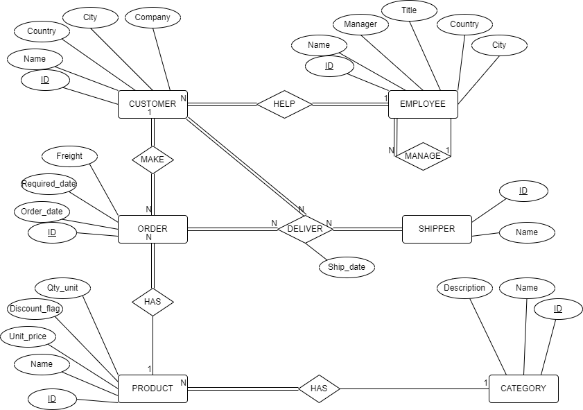
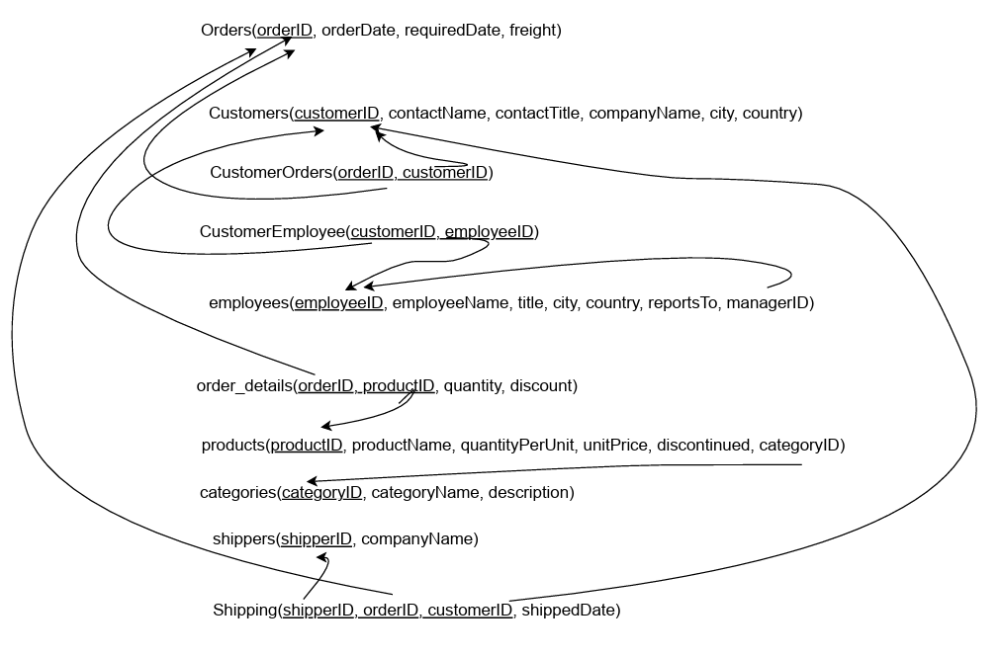
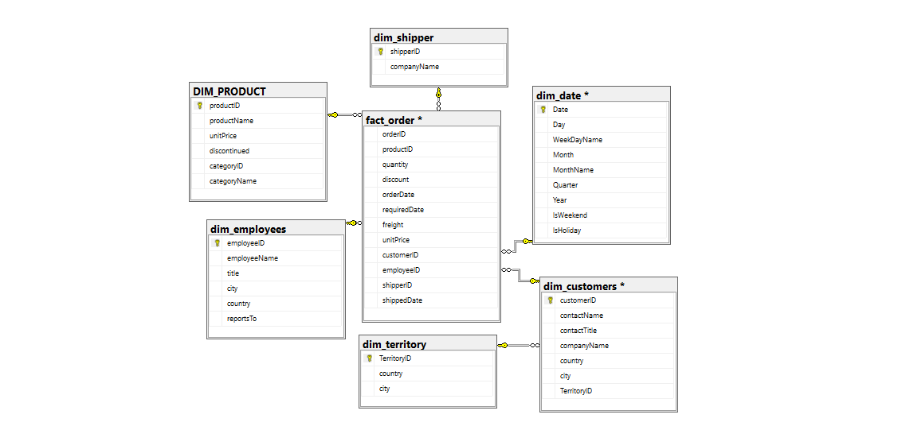

# Data Integration & ETL "DataStage" for TradeXPress

## Table of Contents
1. [Overview](#overview)
2. [Database Design](#database-design)
3. [Data Insertion](#data-insertion)
4. [ETL, Data Warehouse, and Modeling](#etl-data-warehouse-and-modeling)
5. [Analysis and Reporting](#analysis-and-reporting)
6. [Conclusion](#conclusion)

## Overview
This project implements data engineering methodologies and tools to integrate data from various sources for TradeXPress, a global trade company. The project aims to create an efficient schema for querying the integrated data and to support the Business Intelligence (BI) team in gaining actionable insights from the data.

## Database Design
The database design includes tables for orders, customers, employees, products, categories, shippers, and shipping details. Each table has specific columns to store relevant information. Refer to the Database Design section in the project documentation for details.

### ERD

### Mapping

### Database Schema

## Data Insertion
Data insertion involves extracting data from source files and inserting it into the database tables using the import-export wizard in Microsoft SQL Server. Refer to the Data Insertion section in the project documentation for details.

## ETL, Data Warehouse, and Modeling
The ETL process uses IBM DataStage to transform data, drive dimensions, and derive transactional and periodic fact tables. It includes data cleansing, mapping, enrichment, and maintaining data quality. Refer to the ETL, Data Warehouse, and Modeling section in the project documentation for details.

### Diminsional Modelling

### ETL

## Analysis and Reporting
Tableau Public is used for analysis and reporting. A Tableau dashboard provides an interactive overview of the business's performance, including sales trends, product performance, key customer identification, shipping costs and delays, employees' performance, and market analysis. Refer to the Analysis and Reporting section in the project documentation for details.

## Conclusion
The project has successfully integrated data from flat files, transformed it using various techniques, and built a star schema for efficient querying and analysis. Challenges faced include lack of incremental loading, error handling, scheduling, and monitoring in the ETL process. Recommendations for future improvements include implementing these features to improve efficiency and reliability.

## Installation
1. Clone the repository: `git clone https://github.com/your-username/DataIntegrationETL`
2. Install IBM DataStage and Tableau Public.
3. Follow the instructions in the project documentation to set up the database and run the ETL process.

## Usage
1. Run the ETL process using IBM DataStage.
2. Use Tableau Public to analyze and report on the integrated data.
3. Refer to the project documentation for detailed instructions on using the project.

## Credits
- Developed by Ahmed Jumaa
- Contact: ahmed.mmjumaa@gmail.com
## Dashboard

## Documentaion
[Project Documentation Overview](docs/Documentation.pdf): Overview of the project, its objectives, and scope.

[Documentation.pdf](https://github.com/jumaa0/MyWish-Application/files/14805149/Documentation.pdf)

